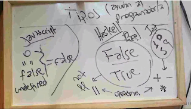
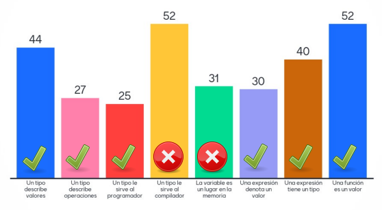
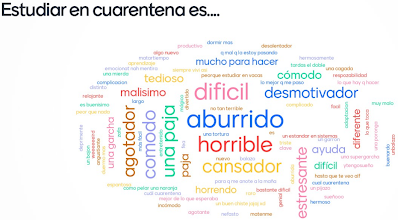

# Clase 02 - Testing y División en Subtareas

Fecha: 16/04/2020

¡Buenas!

Hoy respondimos consultas varias sobre la tarea dejada la clase pasada, y hablamos de Tipos y de Testing automatizado.

Mil disculpas por la duración de la clase, espero que puedan revisar la última parte después si ya estaban quemadxs. Recuerden que acá estamos por cualquier traba que tengan, ó cualquier problema aunque no esté directamente relacionado con la materia.

Materiales que dan soporte a los temas de hoy

* Grabación de Meet 2:30hs En los link de siempre. Sobre división en subtareas lo único que tenemos está ahí.
* Las [diapos](https://docs.google.com/presentation/d/e/2PACX-1vSGgYgXth-384ZFpWVzldHjMyxLnuabFUyfDhlIK-0nSXo8su7YKTNYSgU2-_nlM8AyVVXVXSk-t2NG/pub?start=false&loop=false&delayms=3000) de la clase
* El [código](https://github.com/pdepjm/2020-f-Pinos) de la clase de hoy (ejercicio de los Pinos)
* [Video 12'](https://www.youtube.com/watch?v=FCwwOM_7jZo)	Qué es stack (Gestor de Proyectos).
* Artículo Wikipedia	[Qué es testeo automatizado](https://es.wikipedia.org/wiki/Prueba_unitaria)
*	 Apunte 6 páginas	[Cómo se testea en Haskell con Hspec](https://docs.google.com/document/d/17EPSZSw7oY_Rv2VjEX2kMZDFklMOcDVVxyve9HSG0mE/edit)
* Video 5'	El [video](https://archive.org/details/wat_destroyallsoftware) bardeando a Javascript y Ruby que mencionó Gise cuando hablamos de tipos
*	[pdf 3 páginas](assets/Clase%202%20Pdep%20Jueves%20mañana%202020-Mentimeter-Encuesta.pdf)	Los resultados del mentimeter de hoy.

### Tarea obligatoria

*	Programar en IDE	TP1 parte B Individual. Enunciado: Ponerle tipos a todas las funciones del TP1, y escribir los tests. Subirlo al mismo repo y avisar a tutores.	Se entregaba hoy, por habernos extendido, damos changüí hasta Sábado 18/04 23:59hs
* Lección Mumuki	TP2 Enunciado: hacer las siguientes guías y avisar a les tutores.
 * Guía 3 entera
 * Guía 4 entera 
 * Guía 5 hasta el ejercicio 4 inclusive 
 * Guía 6 hasta el ejercicio 6 inclusive
* Lunes 20/04 23:59hs

### Más cosas hechas hoy

Las respuestas correctas e incorrectas para las preguntas que hicimos hoy:

El graficón pandémico:

