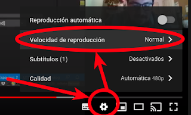

# Clase 11 - Intro al Paradigma Lógico

Fecha: 18/06/2020

La clase comienza 9:15.

Comenzaremos por mirar este [video de intro a lógico](https://youtu.be/4M-lzIOhVbI), y luego 10:15 retomaremos clase. Recuerden que los videos pueden reproducirse más rápido si lo necesitan, eligiendo la velocidad en la tuerquita.

### Materiales que dan soporte a los temas de hoy

* Google Meet  En el link de siempre.
* Diapos	Las [diapos](https://docs.google.com/presentation/d/1K2YnQETD9aMtZzVFaDgCDwMR4HpEArrKb9oXz37mnWA/edit?usp=sharing) de la clase
* Video 45' + Diapos	 [Intro a Lógico](https://www.youtube.com/watch?v=4M-lzIOhVbI) ([diapos](https://docs.google.com/presentation/d/e/2PACX-1vRJTUxGna0bJtzyxfiy7_07z4wlMRMGbWWmcfdLE5b01Hn2Ez1vRIW3K67avTRlNJNOEEghY9ZnkM2k/pub?start=false&loop=false&delayms=3000&slide=id.p) del video)
* Repo	[Código de hoy](https://github.com/pdepjm/2020-l-librosYcomics)
* Mumuki	[Guías 1, 2, y mitad de la 3 de mumuki](https://mumuki.io/pdep-utn/chapters/436-programacion-logica)
* Apuntes 	
  * [Módulo 1](https://drive.google.com/open?id=1fTYHcILOkEsfTW5DOcghDSau3pQ6Q2AXlM0iwkB5L4E): Predicados. Individuos. Consultas. Universo Cerrado. 
  * [Módulo 2](https://drive.google.com/open?id=1YDsnBkCOz3bXR3dwvyMcSV9Ui0ATP5fojDwvmu6Rqss): Variables. Consultas Existenciales. Reglas simples y compuestas. Inversibilidad.
  * [Anexo A](https://docs.google.com/document/d/1vxDrdDeVmPeOoKWJvYbcEKFDgE14mnFDhUf0YPGGaM4/edit): Testeo con PlUnit

### Tarea obligatoria para la clase que viene 

* Guía de instalación	[Guía de instalación de SWI-Prolog](https://github.com/pdep-utn/enunciados-miercoles-noche/blob/master/pages/prolog/entorno.md). Deben instalarse el entorno para hacer el primer TP Individual de lógico.  
***Fecha de entrega/finalización:*** Lunes 22/06 23:59 hs
* TP 1 Individual	[Enunciado](https://docs.google.com/document/d/18VMNw0u0B58TFfxaMtYdXV4ZQOUEAWL87HAP8K1jKLs/edit#heading=h.oit40igazgjk) y [classroom](https://classroom.github.com/a/-cZkGEa9).  
***Fecha de entrega/finalización:***  Lunes 22/06 23:59 hs

### Tarea recomendada para la clase que viene

* Desafío "café con leche"	 Quien primero resuelva el desafío [pirámide de números](http://wiki.uqbar.org/wiki/articles/desafio--piramide-de-numeros.html) **en prolog** ¡respetando los conceptos de la materia! y lo envíe **por privado** a la casilla indicada por mail ganará un premio.
* Ejercicio VSCode	 Hacer el último punto (punto 7: rioplatense) del enunciado de clase. Está en las diapos de clase y en el repo de la clase.  
***Fecha de entrega/finalización:*** Miércoles 24/06 23:59 hs 
* Guía Mumuki	 [Guías 3 a 7 de Mumuki lógico](https://mumuki.io/pdep-utn/chapters/436-programacion-logica): cubren los temas de la clase que viene.  
***Fecha de entrega/finalización:*** Miércoles 24/06 23:59 hs 
* Apunte	 [Testing en Prolog con PLUnit](https://docs.google.com/document/d/1vxDrdDeVmPeOoKWJvYbcEKFDgE14mnFDhUf0YPGGaM4/edit#)  
***Fecha de entrega/finalización:*** Miércoles 24/06 23:59 hs .