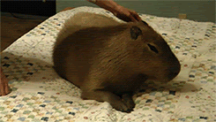

# Clase 13 - Functores y Polimorfismo

Fecha: 02/07/2020

### Materiales que dan soporte a los temas de hoy

* Google Meet  En el link de siempre.
* Diapos	Las [diapos](https://docs.google.com/presentation/d/1DMgsMn6mRs5HOFYXIdIbFkbSur94AhxWmxJsb0Hm7UU/edit?usp=sharing) de la clase
* Archivo pl	[Código de hoy](./assets/jugadores.pl)
* Documento [Resultados del menti](./assets/Clase%2013%20-%20Logico.pdf) de hoy
* Mumuki	[Hasta la guía 9](https://mumuki.io/pdep-utn/chapters/436-programacion-logica) inclusive.
* Apuntes 	
  * [Módulo 3](https://drive.google.com/open?id=1GGair_St5yWvItKRZH-FY_X2CdDREr60TrsV0zSiO5I) Estructuras de datos. Individuos simples y compuestos.
  * [Módulo 6](https://drive.google.com/open?id=1eWnjBoiQTRJKx4THhmPnGYbBWTDlgx4Fph18GPtIqC0):Elementos de Diseño. Delegación. Acoplamiento. Code smells. (Primera parte)

### Tarea obligatoria para la clase que viene 

* TP Individual	TP2 TEG **Todo el TP**. [Enunciado](https://docs.google.com/document/d/12RK1DhOHEH9PgKYJo3zH_trn1fOn8jB9bg304ZLMXbQ/edit?usp=sharing) y [classroom](https://classroom.github.com/a/Gpa7wf3r).  
***Fecha de entrega/finalización:*** Lunes 13/07 23:59 hs
*  [Encuesta Anónima](https://docs.google.com/forms/d/e/1FAIpQLSdRtr4mHVwidjlCum1SCxGB1zafdFlQTmMZT4VyKDLwQd3-bg/viewform) ¡Quienes no la hayan hecho!

### Tarea recomendada para la clase que viene

* Guía Mumuki	[El resto de las guías de Mumuki](https://mumuki.io/pdep-utn/chapters/436-programacion-logica): cubren los temas de hoy y algo de la clase que viene.  
***Fecha de entrega/finalización:*** Miércoles 15/07 23:59 hs   
