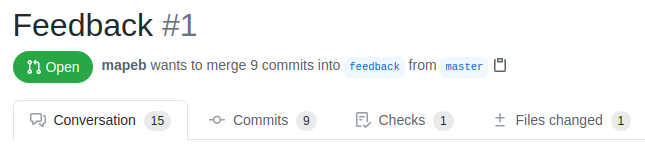

# Clase 15 - Resolución Simulacro Lógico - Ratatouille

Fecha: 23/07/2020

Hoy dimos la resolución del simulacro de Ratatouille.

### Materiales que dan soporte a los temas de hoy

* Google Meet  En el link de siempre.
* Simulacro [Enunciado](https://docs.google.com/document/d/14Yl1bvRpTeZSMc6ZW2JFEo8wsn7WTVQTBqUhiDwbYw0/edit?usp=sharing) y [Classroom](https://classroom.github.com/a/H5WQlUbT)
* Documento Resultados del menti de hoy
* Archivo pl	Código de hoy
* Serie de videos [Resolución](https://youtu.be/FysNBkzJQ8o) paso a paso de parcial/ejercicio integrador Hogwarts. [Enunciado](https://docs.google.com/document/d/e/2PACX-1vR9SBhz2J3lmqcMXOBs1BzSt7N1YWPoIuubAmQxPIOcnbn5Ow9REYt4NXQzOwXXiUaEQ4hfHNEt3_C7/pub) y [repo](https://github.com/pdep-mit/practica-logico-casas-de-hogwarts) base.

### Tarea obligatoria para la clase que viene 

* Trabajo Práctico 	TP Integrador Grupal de lógico: **Mafia**. [Enunciado](https://docs.google.com/document/d/1brkOu4GNBPd7PoBJWWmmXV0r9ie-PWl11B7903MEBo0)  y [Classroom](https://classroom.github.com/g/fYX8lZor)  
***Fecha de entrega/finalización:*** Lunes 10/08 23:59 hs.
* TPs individuales	Hacer todas las correcciones pendientes de todos
los TPs, tanto de **lógico** como de **funcional.**  
***Fecha de entrega/finalización:*** Miércoles 12/08 23:59 hs

### Notas de parciales y correcciones

Cómo ver las correcciones de parciales:

1. En [esta dirección](https://docs.google.com/spreadsheets/d/1bXwWRbpdxYZ1KEYwwrHcFFZwDzNFDlw4u6273qvYvPk/edit#gid=0) tienen las notas por punto.
2. Entran a su **Repositorio** -> pestaña **Pull Requests** y van a ver un PR así:

3. En la pestaña **conversation** hay un resumen de todos los comentarios (en particular a algunes les escribimos un **comentario resumen** del parcial).
4. En la pestaña **files changed** se van a encontrar con su código y las correcciones ordenadas en el código.

En **conversation** puede haber más cosas que en files changed, así que no olviden chusmearla por si les faltó leer algo.

- El primer **recuperatorio** de funcional será el día sábado 08/08 a las 9am con las mismas condiciones que fue este parcial.
- Abajo les dejamos un instructivo de cómo ver las **correcciones** de sus parciales.
- Las dudas, consultas y **revisiones** a sus tutores por Discord.
