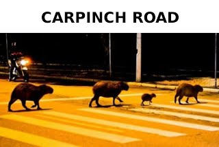

# Clase 18 - Intro al Paradigma de Objetos

Fecha: 27/08/2020

Y se viene la recta final: ¡El paradigma de objetos!

### Materiales que dan soporte a los temas de hoy

* Google Meet y videos de clase  En el link de siempre.
* Diapos 	[Acá](https://docs.google.com/presentation/d/e/2PACX-1vQnVZw6d-A2dKkv7tXBLSlWhpUi2WT5qpDnK1_Z_eHPdZ5bHLIXsmdcQG9TrKSEEas_p2ryq7oJ69R6/pub?start=false&loop=false&delayms=3000)
* Google Form	[Encuesta obligatoria](https://docs.google.com/forms/d/e/1FAIpQLSfmn2NIAmEpkkssOM3G78P8kKG2Qme7tlayLxBls99NitHNFQ/viewform)
* Repo y doc	[Código de hoy](https://github.com/pdepjm/2020-o-pepita) y [enunciado](https://docs.google.com/document/d/e/2PACX-1vQ8Szx9LtBp-KBRn3KhCA9luGCjC-UBWpFPYXOP4uuc9iXjhzRQ0l2Dg0eNgPHsMHpYY-pTVc74ieEL/pub) de Pepita
* Mumuki	[Ejercicios de las lecciones 1 a la 5](https://mumuki.io/pdep-utn/chapters/437-programacion-con-objetos).

### Tarea obligatoria para la clase que viene 

* Definir grupo	 Definir grupos de 4 y cargarlo en [este formulario](https://docs.google.com/forms/d/e/1FAIpQLSfbhCr3ImKVBqvWqFGwQw-9oPdSiLtmu1glJqLUtSlMMse0AQ/viewform)  
***Fecha de entrega/finalización:*** Jueves 02/09 23:59
* Trabajo Práctico 	TP Individual: Peligro por Distracción. [Enunciado](https://docs.google.com/document/d/e/2PACX-1vQfoN8U5L5kU0q7CvPNcfn47uPnr90qaQ5XklbUwXlbiImzaxgVr2roWhoipriqGWjsf-bqWCCaaxVz/pub) y [Classroom](https://classroom.github.com/a/u3jzGn_J).  
***Fecha de entrega/finalización:*** Martes 01/09 23:59 hs
