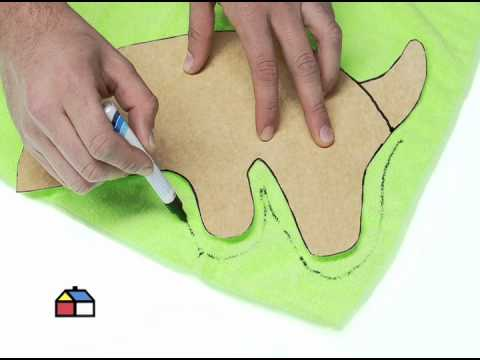

# Clase 22 - La clase de clases

Fecha: 24/09/2020

### Materiales que dan soporte a los temas de hoy

* Google Meet  En el link de siempre.
* Diapos 	[Acá](https://docs.google.com/presentation/d/14d4kUm6Tq4XI7Ao4jdEhMRViozmhHNkOvxx7Cwqjorg/edit?usp=sharinghttps://docs.google.com/presentation/d/14d4kUm6Tq4XI7Ao4jdEhMRViozmhHNkOvxx7Cwqjorg/edit?usp=sharing)
* Enunciado 	Ejercicio de clase: [Dr Casa](https://docs.google.com/document/d/e/2PACX-1vSKis9EsyUj2c6qMv_NbJYcFs4Mi9RXZQYYSparlzLspuFMt3v0LpjVXXOGctdqqNTXOT5PcStNpjjz/pub)
* Repos con código de la clase	
  * Práctica de referencias: [Ahorros](https://github.com/pdepjm/2020-o-ahorros)
  * Ejercicio [Dr Casa](https://github.com/pdepjm/2020-o-drCasa)
Pueden obtener una copia de los repos usando el botón de "Template"
* Mumuki	[Guía 10](https://mumuki.io/pdep-utn/lessons/721-programacion-con-objetos-clases-e-instancias)
* Apuntes	[Módulo 8](https://docs.google.com/document/d/1Dgq_PfCbJHO1M7dXe-vGXtj4mbEUWlYhfvQ2i0RWOsk/edit#)

### Tarea obligatoria para la clase que viene 

* **Trabajo Práctico Integrador**	Definir la idea para el juego **con sus ayus** para poder ir comenzando el proyecto: [Classroom](https://classroom.github.com/g/IEGOmqrh). Recuerden que al ser una tarea grupal el primer integrante que la acepte debe crear el grupo y el resto unirse. 
***Fecha de entrega/finalización:***  Lo antes posible, no cuelguen. 

### Tarea recomendada para la clase que viene

*  Práctica	Terminar la primera temporada de Dr Casa
* Práctica	Hacer el tutorial de game de [pepita](https://github.com/wollok/elJuegoDePepita).
* Jugar 	Inspirarse jugando sus juegos favoritos.
