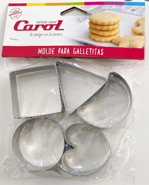

# Clase 22 - La clase de clases

Fecha: 16/09/2021

### Materiales que dan soporte a los temas de hoy

* Google Meet  En el link de siempre.
* Diapos 	[Acá]()
* Enunciado Ejercicio de clase: [Wollok Game Worlds](https://docs.google.com/document/d/11TbK24ojSHOfInboa5mi0ptENhloaXOINLwa5vLlwnQ/edit)
* Repos con código de la clase [Acá]()
* Mumuki	[Guía 10](https://mumuki.io/pdep-utn/lessons/721-programacion-con-objetos-clases-e-instancias)
* Apuntes	[Módulo 8](https://docs.google.com/document/d/1Dgq_PfCbJHO1M7dXe-vGXtj4mbEUWlYhfvQ2i0RWOsk/edit#)

### Tarea obligatoria para la clase que viene 

* **Kata 3**	Definir la idea para el juego y empezar a codear. Comunicarse **con los tutores** para confirmar las ideas. 
[Classroom](). Recuerden que al ser una tarea grupal el primer integrante que la acepte debe crear el grupo y el resto unirse. 
***Fecha de entrega/finalización:***  Miércoles 29/09 23:59hs . 
* **Trabajo Práctico Integrador**	Definir la idea para el juego y empezar a codear. Comunicarse **con los tutores** para confirmar las ideas. 
[Classroom](). Recuerden que al ser una tarea grupal el primer integrante que la acepte debe crear el grupo y el resto unirse. 
***Fecha de entrega/finalización:***  Miércoles 29/09 23:59hs . 
