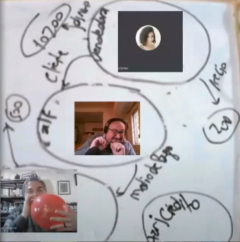
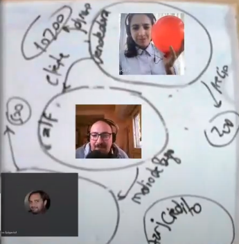
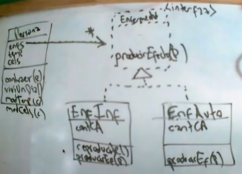
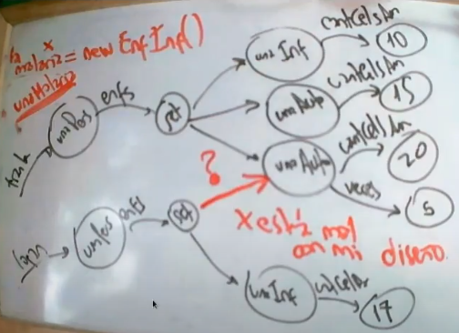

# Clase 23 - Excepciones y Solución Kata 3

Fecha: 30/09/2021

### Materiales que dan soporte a los temas de hoy

* Google Meet  En el link de siempre.
* Diapos 	[Acá](https://docs.google.com/presentation/d/1h_d6dhnqKGpd0oEl4ZXAKrm8MK-BLk3ZkX8SyEPIUJE/edit?usp=sharing)
* Repos con código de la clase [Acá](https://github.com/pdepjm/2021-o-drCasaEnClase)
* Mumuki	[Guía 9 Excepciones](https://mumuki.io/pdep-utn/lessons/720-programacion-con-objetos-excepciones) (Se pueden hacer todas las guías hasta la 10)
* Apuntes	[Módulo 11 Testeo Automatizado avanzado](https://docs.google.com/document/d/1caDE_mlP1QMfzyVpyvh-tKshjAeYLXBkXDYrTX5zFUI/edit#)

### Tarea obligatoria para la clase que viene 

- Avanza con el TP Integrador [(Pautas/Enunciado)](https://docs.google.com/document/d/18WIn-4vs75gLPpGrZO-O_kmRLVmd9CnnnYzon_aTjzQ/edit#) 
- Cerrar las Katas que deban.

