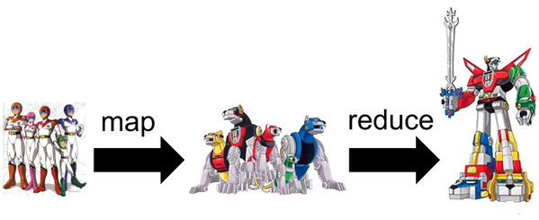

# Clase 06: Recursividad, Fold, Estrategias de evaluación

Fecha: 19/05/2022

### Temas de hoy
* Recursividad. 
* Listas como estructuras recursivas. Patrón de listas. Definición de orden superior con listas.  
* Familia fold. 
* Listas infinitas. Evaluación diferida. 

### Material que acompaña la clase de hoy

* Las guías 12, 16 y 17 de [Mumuki](https://mumuki.io/pdep-utn/chapters/435-programacion-funcional) cubren los temas de hoy. 
* En los [Apuntes](https://www.pdep.com.ar/material/apuntes), Módulos 4 y 5 de funcional, más el de "La familia Fold".
* Video 17' [Estrategias de Evaluación y Listas infinitas](https://www.youtube.com/watch?v=wZ0pBezum58)
* Video 30' [Video de Fold](https://www.youtube.com/watch?v=veiQkxz59NE) ¡Ver en velocidad 1.5x!
* En los [Videos](https://www.pdep.com.ar/material/videos) de la página, hay videos sobre estos temas.
* Acá está el [Apunte de estrategias de evaluación y la tablita de matcheo completa](https://docs.google.com/document/d/1veQODRMHUnCiYCE9l4MHugdhJB760488F2ghhP2fZFs/edit?usp=sharing)
* Código que hicimos en clase [en el repo](https://github.com/pdepjm/2022-f-clase06)
* [Diapos de la clase](https://docs.google.com/presentation/d/1VcCNEhkn0ILgo7iqMK9rfSUyoB5DwBCL5sFx-oAQfko/edit?usp=sharing)

### Tarea obligatoria

#### para el jueves que viene (aunque no haya clases) o antes
1. TP Grupal en máquina última entrega. [Enunciado de la Entrega 2](https://docs.google.com/document/d/1V2LYeaIEN4VOg3pYJsPU5Oj1OpbjgAi72o71rBAs9pM/edit?usp=sharing)

#### para la próxima clase (en 2 semanas)
1. Comenzar a leer el [simulacro de parcial <próximamente>](). Habrá un ratito para avanzarlo la semana que viene, así que si quieren pueden empezarlo en casa y lo terminan en clase. 
2. Recuerden que **quien piense rendir el parcial con su notebook, debe traerla también próxima clase**. Es simulacro, la idea es solucionar todos los problemas técnicos que pueda haber antes del día del parcial.

### Tarea opcional para la clase que viene
1. Todo Mumuki.