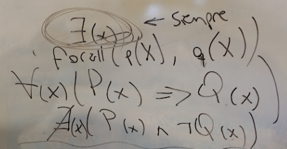

# Clase 10: Cuantificación Universal
## Predicados de alto orden: not y forall

Fecha: 23/06/2022

### Materiales que dan soporte a los temas de hoy

* Grabación de la clase (link en Discord)
* Repo	[Código de hoy](https://github.com/pdepjm/2022-l-clase10NotForall)
* Mumuki	[Guías 3 y 4 de Mumuki](https://mumuki.io/pdep-utn/chapters/436-programacion-logica)
* Apuntes 	
  * [Módulo 4](https://drive.google.com/open?id=1GGair_St5yWvItKRZH-FY_X2CdDREr60TrsV0zSiO5I)(menos findall, que lo veremos más adelante)
  * Video 17' [Testing en Prolog](https://youtu.be/tzTn0-iqz44)

### Tarea obligatoria para la clase que viene 
* TP Individual 2 de Lógico, en PC, usando SWI.Prolog con tests. [Enunciado acá](https://docs.google.com/document/d/1EkptEkw-U9mk4TFPN01qt0UWhuI-yq8CbxE5BkH2r60) y la [tarea con el repo acá](https://classroom.github.com/a/F8II9jS2).

