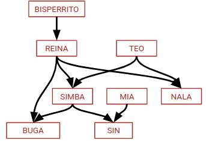

# Clase 12 - Recursividad y listas

Fecha: 07/07/2022

### Materiales que dan soporte a los temas de hoy

* [Diapositivas](https://docs.google.com/presentation/d/1NVuDP-9T81gSktgz0iqT_dsDNE5Hcehy-XeIlbrKjmQ/edit#)
* [Resultados](./assets/2022%20-%20Logico%20repaso%20inversibilidad.pdf) del Menti de hoy (Ver el repo para el código con las respuestas).
* [Código hecho en clase](https://github.com/pdepjm/2022-l-clase12listasyRec).
* [Casos de no inversibilidad](https://wiki.uqbar.org/wiki/articles/paradigma-logico---casos-de-no-inversibilidad.html). ¡Pero ojo! Es más fácil (y más correcto) pensar en el caso que tengo **qué variables están ligadas**, cuáles no, cuál es **el sentido**, la semántica de la consulta que estoy haciendo.
* Ya se puede hacer todo Mumuki	https://mumuki.io/pdep-utn/chapters/436-programacion-logica

### Tarea obligatoria para la clase que viene

* Traer comenzado el [Simulacro](https://docs.google.com/document/d/1ceEtqSEAgIpGZ-qdx4qhevLr7nmU80H9Dn4DD5y1Rp4/edit?usp=sharing). El repo lo pueden crear a partir del [repo base de lógico](https://github.com/pdepjm/2021-l-repoBase) con el botón "Use this template". Lo copado de ese template es que les corre los tests cada vez que pushean.

### Tarea recomendada para la clase que viene

*  Traer dudas sobre el [enunciado del TP Grupal](https://docs.google.com/document/d/1mXm6TUTL99WnqCR4vSvmAfzgBSuF0TjI89Ui395OWE4/edit) (única entrega) y les dejamos la [Tarea del classroom](https://classroom.github.com/a/s-QPiW32) que se entrega en unas semanas al volver del receso.