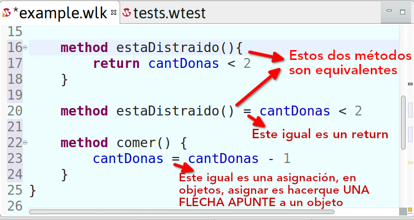

# Clase 17 - Self - Repaso - Polimorfismo

Fecha: 01/09/2022

### Materiales que dan soporte a los temas de hoy

* Hoy hicimos un repaso en el que hicimos entre todes los ejercicios de la [guía 5 de Mumuki](https://mumuki.io/pdep-utn/lessons/716-programacion-con-objetos-practica-objetos-y-mensajes)
* Vimos cómo funciona Wollok Game:
  * [Ejemplo Juego Game - Puma Game](https://github.com/wollok/pumaGame)
  * [Práctica Game Juego Mario - tarea de classroom](https://classroom.github.com/a/rp-J-ALM) que hicimos al final de la clase.
  * [Ejemplo historias - Titanic](https://github.com/wollok/TitanicGame)

* Apuntes y material teórico:
  * [Módulo 03](https://docs.google.com/document/d/1X7Sz12e7rbVO1x7uMD7ECjZnT-chELx0ElTPmNvNURU/edit#): Introducción a Polimorfismo.
  * [Wiki polimorfismo](http://wiki.uqbar.org/wiki/articles/polimorfismo-en-el-paradigma-de-objetos.html)

### Tarea obligatoria para la clase que viene 

* Trabajo práctico individual 1: [Cotización de la papa](https://docs.google.com/document/d/1a9qIWXcamWsLg9ffc04fQ5PT6bEHoAQHc-ztnDrW7TQ/edit?usp=sharing), y [la tarea del classroom](https://classroom.github.com/a/K9cJLJ1N) para el repo. Se hace en Wollok.