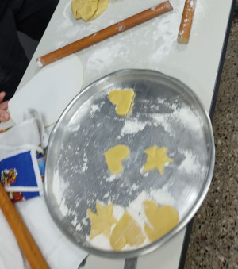
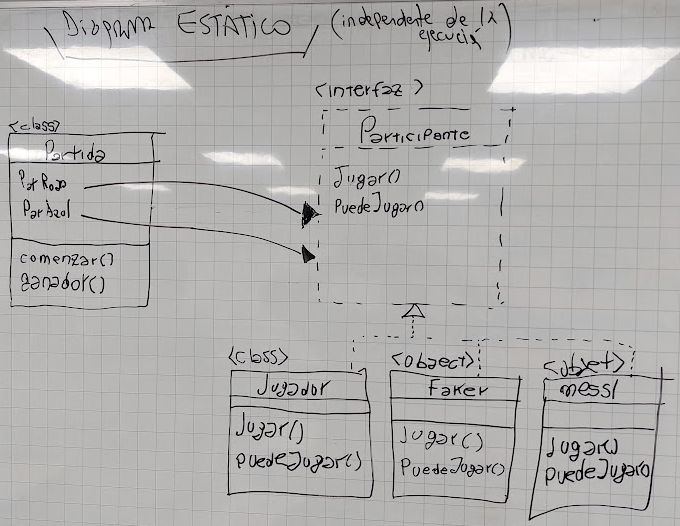

# Clase 19 Clase de Clases y Errores LAS GALLETITAS

Fecha: 15/09/2022

- Ejercicio hecho en clase: [Wollok Game Worlds](https://docs.google.com/document/d/1EIXQaAt9ncyieOH0wYM_VsOZgnxIyg7hpC3EWuPTwcw/edit#)
- Código hecho en clase: [Repo](https://github.com/pdepjm/2022-o-wollok-game-worlds)
- [Apunte teórico completo de la clase](https://ambiguous-decimal-9e5.notion.site/Clase-de-Clases-745e2ea0be1849a5b475dd01203ce440) (el enunciado y el código es del año pasado, pero sirve)

### Tarea
- Obligatoria no hay, pero se puede practicar con el resto del enunciado de Wollok Game Worlds.
