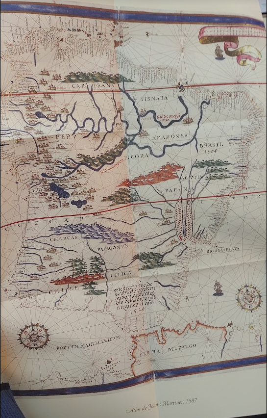

# Clase 11: Functores y aritmética. 

Fecha: 04/07/2024

### Materiales que dan soporte a los temas de hoy

* Hoy vimos functores y aritmética en la primera parte de la clase. [Código de ejemplo](https://github.com/pdepjm/2024-l-intro/blob/main/mapa.pl)
* Repasamos el tema de **unificación**, y cómo una **variable ligada** cambia lo que significa una consulta como un forall (la _semántica_ de la misma).
* Apuntes:
  * [Aritmética en Prolog](https://wiki.uqbar.org/wiki/articles/aritmetica-en-prolog.html)
  * [Módulo 3](https://docs.google.com/document/d/1I8Xvss7LBuUjV-GGiag7C8d9wa3vUB6B37Qi4LG-ts0/edit#heading=h.dr7shnx76bwb): Sólo la parte de functores
  * [Módulo 4](https://docs.google.com/document/d/1GGair_St5yWvItKRZH-FY_X2CdDREr60TrsV0zSiO5I/edit#heading=h.3a0qkoeg9mih): Forall y su inversibilidad

### Práctica y teoría recomendadas

* Explicación de polimorfismo [en la wiki](https://wiki.uqbar.org/wiki/articles/polimorfismo-en-el-paradigma-logico.html).
* Ejercicio de [práctica de TEG](https://docs.google.com/document/d/12RK1DhOHEH9PgKYJo3zH_trn1fOn8jB9bg304ZLMXbQ/edit).

