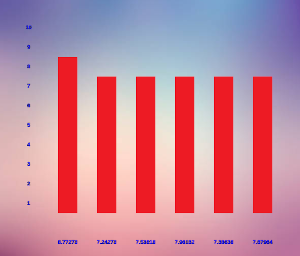

# Clase 23 - Última

Fecha: 28/11/2024

### Material

- [Diapos](https://docs.google.com/presentation/d/e/2PACX-1vRB5RWej8ao3Vc74yWIuHupHKXyLfBp9vwOqskirvjR7xZGbbUeVUgSvPn4Zj5gCg4Zl2Y3br1BItg8/pub?start=false&loop=false&delayms=3000) de la clase.
- [Repositorio con código](https://github.com/pdepjm/2024-ultimaClase) en C#, Java, Wollok y Typescript
- [Esquemas de tipado](https://wiki.uqbar.org/wiki/articles/esquemas-de-tipado.html), es un artículo muy bueno que resume lo que hablamos hoy sobre tipos en lenguajes de programación.
- [Finales](https://www.pdep.com.ar/material/finales) de ejemplo para quienes no puedan promocionar.

### Encuestas (porfa completar cuando puedan/quieran)
- [Encuesta individual fin de cursada](https://docs.google.com/forms/d/e/1FAIpQLSe0YKZ9xST_oSsBBCTRLW28-cFCs68UOekkBLkg7VkYhHlHwg/viewform). Les pedimos que la completen, nos sirve mucho para ajustar año a año nuestras clases. 
- [Encuesta grupal con código](https://docs.google.com/document/d/191sPTnrv7XXMaTHA2baxB1k9xDKxrxnEf-i8iSssZw0/edit?tab=t.0)

